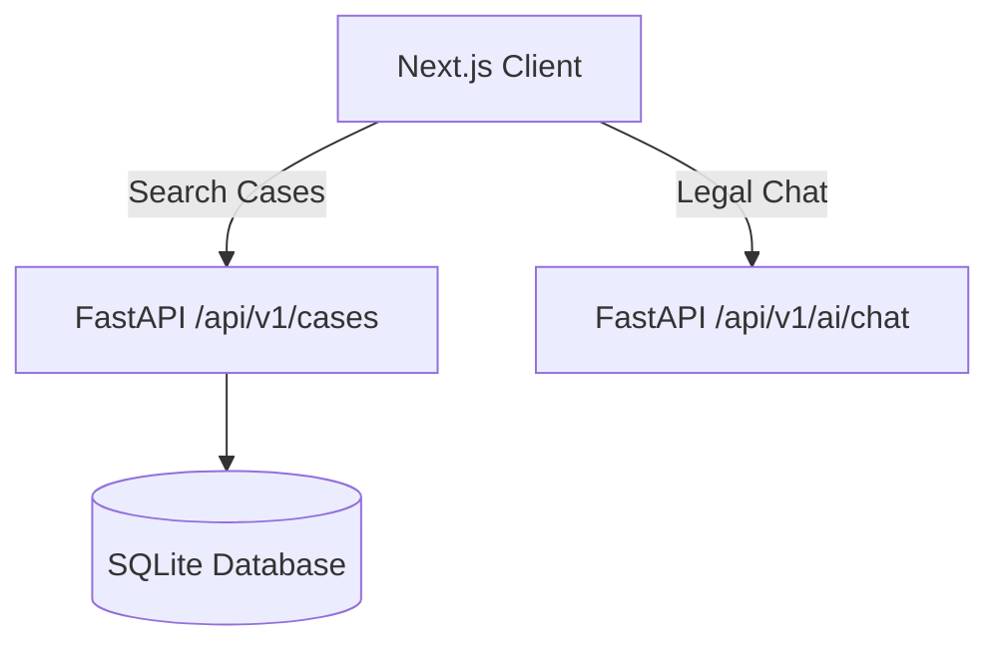

# 🏛️ Lex India

> **India-first legal intelligence.** A dual-track platform built to simplify Indian law.

---

## 🚀 Key Features

*   **For Citizens:** Plain-language legal notice parser, urgency gauges, and matched human advocate discovery.
*   **For Advocates:** High-density case law database query client and document drafting workspace.

---

## 📦 Tech Stack & Design System

*   **Frontend:** Next.js 16 (App Router) + React 19 + Vanilla CSS
*   **Backend:** FastAPI + Uvicorn + SQLAlchemy (SQLite)
*   **Aesthetic:** Warm classic legal layout (`--bg: #f5f1e8`, serif headings, emerald/gold accents)



---

## 📂 Repository Layout

```text
LexIndia/
├─ backend/                  # FastAPI Application
│  ├─ routers/               # Route endpoints (cases.py, chat.py)
│  ├─ database.py & models.py # SQLAlchemy model definition & schema
│  ├─ seed_db.py             # Mock data initializer
│  └─ main.py                # Server entrypoint & CORS config
└─ frontend/                 # Next.js Application
   ├─ src/app/               # Page routes (citizen, research, ai-assistant)
   ├─ src/components/        # Shareable UI modules
   └─ globals.css            # Global theme variables & tokens
```

---

## ⚡ Quick Start

### 1. Run Backend
```powershell
cd backend
python -m venv venv
.\venv\Scripts\Activate.ps1   # Windows
pip install -r requirements.txt
python seed_db.py             # Seed SQLite
uvicorn main:app --reload --port 8000
```
*API docs run at: http://127.0.0.1:8000/docs*

### 2. Run Frontend
```powershell
cd frontend
npm install
copy .env.example .env.local
npm run dev
```
*App client runs at: http://localhost:3000*

---

## 🔌 API Reference

| Endpoint | Method | Description | Payload / Response |
| :--- | :--- | :--- | :--- |
| `/api/v1/cases/` | `GET` | Filter cases by query `q` | Returns list of matching case citations |
| `/api/v1/ai/chat/` | `POST` | Process legal text via assistant | `{"message": "..."}` -> Returns severity, steps, disclaimer |
